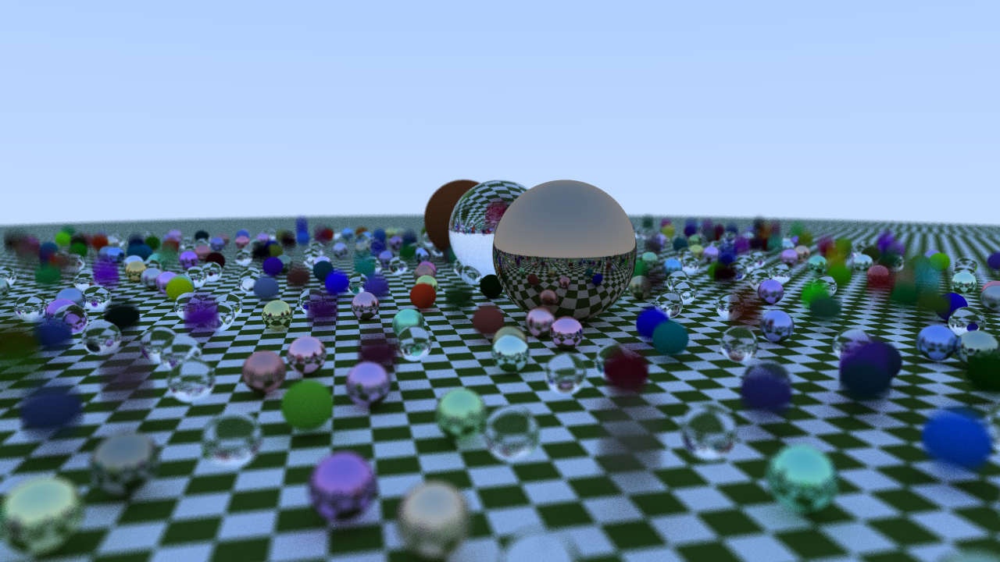
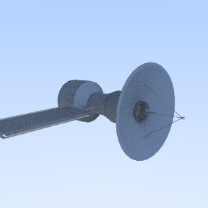
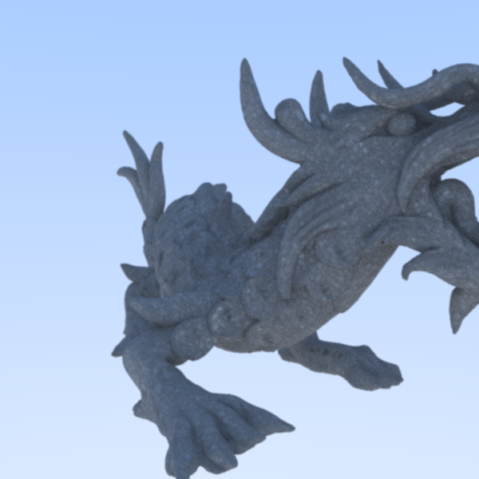

# Toy Raytracer
with inspiration from the "Ray Tracing in One Weekend" book series by Peter Shirley  

This is a CPU based raytracer with some basic support for 3D models, and light based rendering methods  

This project is a rust port with additional addons.  

## Example Renders
Below are a few renders I made, the 3d objects are fairly low quality and noisy due to the slow speeds my CPU calculates large meshes at, the Standford Dragon, for example, took 21 hours and 30 minutes at 150 samples per pixel with 20 light bounces.




## Build Instructions
This will build the demo scene

Ensure you are on the nightly build, this is a prerequisite for SIMD instruction sets
```
rustup default nightly
```

Cloning, building, and running command to view options
```
git clone https://github.com/canarado/rust-rt

cd rust-rt

cargo b -r

// windows
.\target\release\raytracer.exe --help

// linux
./target/release/raytracer --help
```

## Custom Scenes
Until there is a gui to do so, or a configuration file, something alone those lines,
you can add objects with materials into the scene in the code in the appropriate section in `main.rs`

## TODO
- [x] optimize vector math with SIMD
- [ ] add config file for custom scenes
- [x] add rayon for multiple threads rendering
- [x] output to png instead of ppm
- [x] add program flags
    - [x] output file name and directory
    - [x] image dimensions
    - [x] core count
    - [x] sample rate
- [ ] GPU based rendering
- [ ] GUI preview + object config
- [ ] update functions to use one thread_rng per thread instead of random ones thrown about
- [ ] modularize code and move vital functions out of main
- [x] change progress bar to increment when a thread exits instead of when one is spawned
- [ ] add license
- [ ] add matrix transformations to move, scale, and rotate meshes
- [ ] optimize bvh or implement KD-Trees